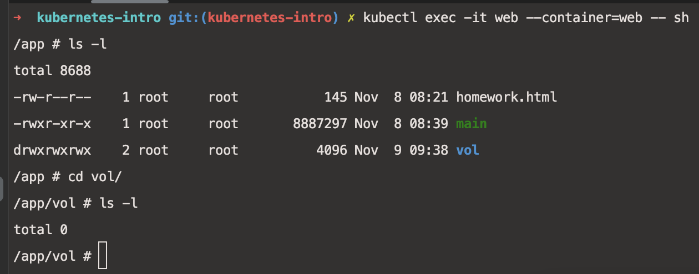

# Выполнено ДЗ № 1

- Основное ДЗ
- Задание со *

## В процессе сделано:
1. Добавлены actions в master.
2. Написан сервис на GO.
    - собран Dockerfile, сделан образ и выложен в мой DockerHub
    - написан манифест по запуску сервиса в pod - `kubernetes-intro/web-pod.yaml`
    - сервис рендерит `homework.html`
    - создан init-контейнер, прикручен volume к init и к основному, но в основной контейнер файл `index.html` не прокидывается. Папка пустая:
        

        
        

    Прошу помочь разобраться в чем причина. И я научу сервис пендерить и будет доступность по `http://localhost:8000/index.html`
3. Выполнено задание `frontend`. Добавлен корректный манифест `kubernetes-intro/frontend-pod-healthy.yaml`. Проблема была в отсутствии env переменных, сервис падал с паникой.

## Как запустить проект:
- Поднять pod `kubernetes-intro/web-pod.yaml` 

## Как проверить работоспособность:
- Перейти по ссылке http://localhost:8000/homework.html

## PR checklist:
- [ ] Выставлен label с темой домашнего задания